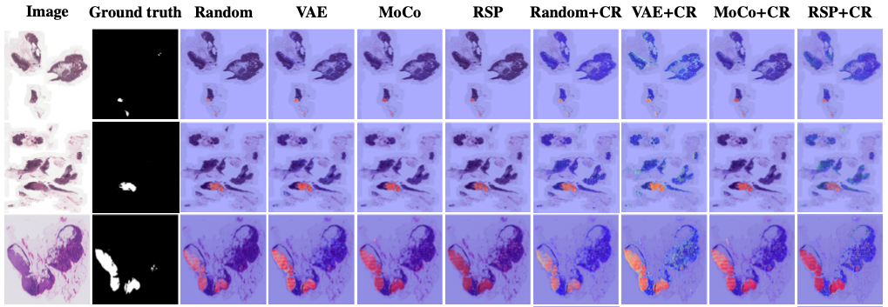

#  Self-Supervised driven Consistency Training for Annotation Efficient Histopathology Image Analysis
#### by [Chetan L. Srinidhi](https://srinidhipy.github.io), [Seung Wook Kim](https://seung-kim.github.io/seungkim/), [Fu-Der Chen](https://www.photon.utoronto.ca/people) and [Anne L. Martel](https://medbio.utoronto.ca/faculty/martel)

* Official repository for [Self-Supervised driven Consistency Training for Annotation Efficient Histopathology Image Analysis](https://arxiv.org/pdf/2102.03897.pdf). Accepted in **Medical Image Analysis (MedIA)**, October, 2021. [[Journal Link]]() [[arXiv preprint]](https://arxiv.org/pdf/2102.03897.pdf)

* <a href="https://github.com/srinidhiPY/SSL_CR_Histo/tree/histo/Pretrained_models">.svg"/></a>

## Overview
We propose a self-supervised driven consistency training paradigm for histopathology image analysis that learns to leverage both **task-agnostic** and **task-specific** unlabeled data based on two strategies:

1. A **self-supervised pretext task** that harnesses the underlying **multi-resolution contextual cues** in histology whole-slide images (WSIs) to learn a powerful supervisory signal for unsupervised representation learning.

2. A new **teacher-student** semi-supervised **consistency paradigm** that learns to effectively transfer the pretrained representations to downstream tasks based on prediction consistency with the task-specific unlabeled data.

We carry out extensive validation experiments on **three** histopathology benchmark datasets across **two classification** and **one regression-based** tasks: 
- [Tumor Metastasis Detection (Breast)](https://camelyon16.grand-challenge.org)
- [Tissue-Type Classification (Colorectal)](https://zenodo.org/record/1214456#.YCbVXy3b1hE)
- [Tumor Cellularity Quantification (Breast)](https://breastpathq.grand-challenge.org/Overview/) 

We compare against the state-of-the-art self-supervised pretraining methods based on generative and contrastive learning techniques: [Variational Autoencoder (VAE)](https://arxiv.org/abs/1312.6114) and [Momentum Contrast (MoCo)](https://arxiv.org/abs/1911.05722), respectively.

## 1. Self-Supervised pretext task


## 2. Consistency training


## Results

* Predicted tumor cellularity (TC) scores on **BreastPathQ** test set for **10%** labeled data

<br/>

* Predicted tumor probability on **Camelyon16** test set for **10%** labeled data


## Pre-requisites
Core implementation:
* Python 3.7+
* Pytorch 1.7+
* Openslide-python 1.1+
* Albumentations 1.8+
* Scikit-image 0.15+
* Scikit-learn 0.22+
* Matplotlib 3.2+
* Scipy, Numpy (any version)

Additional packages can be installed via: [`requirements.txt`](https://github.com/srinidhiPY/SSL_CR_Histo/blob/histo/requirements.txt)

## Datasets
* **BreastPathQ**: to download the dataset, check this link :<br/>https://breastpathq.grand-challenge.org/Overview/
* **Camelyon16**: to download the dataset, check this link :<br/>https://camelyon16.grand-challenge.org
* **Colorectal** cancer tissue classification [(Kather et al. 2019)](https://journals.plos.org/plosmedicine/article?id=10.1371/journal.pmed.1002730): to download the dataset, check this link :<br/>https://zenodo.org/record/1214456#.YCbVXy3b1hE

## Training
The model training consists of **three** stages:
1. ***Task-agnostic self-supervised pretext task*** (i.e., the proposed ***`Resolution sequence prediction (RSP)`*** task)
2. ***Task-specific supervised fine-tuning*** (`SSL`)
3. ***Task-specific teacher-student consistency training*** (`SSL_CR`)

### 1. Self-supervised pretext task: Resolution sequence prediction (RSP) in WSIs
From the file **"pretrain_BreastPathQ.py / pretrain_Camelyon16.py"**, you can pretrain the network (ResNet18) for predicting the resolution sequence ordering in WSIs on BreastPathQ & Camelyon16 dataset, respectively. This can be easily adapted to any other dataset of choice.

* The choice of resolution levels for the RSP task can also be set in [dataset.py#L277](dataset.py#L277) while pretraining on any other datasets.
* The argument --train_image_pth is the only required argument and should be set to the directory containing your training WSIs. There are many more arguments that can be set, and these are all explained in the corresponding files.

```python
python pretrain_BreastPathQ.py    // Pretraining on BreastPathQ   
python pretrain_Camelyon16.py    // Pretraining on Camelyon16
```
* We also provided the pretrained models for BreastPathQ and Camelyon16, found in the "Pretrained_models" folder. These models can also be used for feature transferability (domain adaptation) between datasets with different tissue types/organs.   

### 2. Task specific supervised fine-tuning on downstream task
From the file **"eval_BreastPathQ_SSL.py / eval_Camelyon_SSL.py / eval_Kather_SSL.py"**, you can fine-tune the network (i.e., task-specific supervised fine-tuning) on the downstream task with limited label data (10%, 25%, 50%). Refer to, paper for more details.

* Arguments: **--model_path** - path to load self-supervised pretrained model (i.e., trained model from **Step 1**). There are other arguments that can be set in the corresponding files.

```python
python eval_BreastPathQ_SSL.py  // Supervised fine-tuning on BreastPathQ   
python eval_Camelyon_SSL.py    // Supervised fine-tuning on Camelyon16
python eval_Kather_SSL.py    // Supervised fine-tuning on Kather dataset (Colorectal)
```
Note: we didn't perform self-supervised pretraining on the Kather dataset (colorectal) due to the unavailability of WSI's. Instead, we performed domain adaptation by pretraining on Camelyon16 and fine-tuning on the Kather dataset. Refer to, paper for more details.


### 3. Task specific teacher-student consistency training on downstream task
From the file **"eval_BreastPathQ_SSL_CR.py / eval_Camelyon_SSL_CR.py / eval_Kather_SSL_CR.py"**, you can fine-tune the student network by keeping the teacher network frozen via task-specific consistency training on the downstream task with limited label data (10%, 25%, 50%). Refer to, paper for more details.

* Arguments: **--model_path_finetune** - path to load SSL fine-tuned model (i.e., self-supervised pretraining followed by supervised fine-tuned model from **Step 2**) to intialize "Teacher and student network" for consistency training; There are other arguments that can be set in the corresponding files.

```python
python eval_BreastPathQ_SSL_CR.py  // Consistency training on BreastPathQ   
python eval_Camelyon_SSL_CR.py    // Consistency training on Camelyon16
python eval_Kather_SSL_CR.py    // Consistency training on Kather dataset (Colorectal)
```

## Testing
The test performance is validated at **two** stages:

1. **Self-Supervised pretraining followed by supervised fine-tuning**
* From the file **"eval_BreastPathQ_SSL.py / eval_Kather_SSL.py "**, you can test the model by changing the flag in argument: '**--mode**' to '**evaluation**'.

2. **Consistency training**
* From the file **"eval_BreastPathQ_SSL_CR.py / eval_Kather_SSL_CR.py"**, you can test the model by changing the flag in argument: '**--mode**' to '**evaluation**'.

The prediction on Camelyon16 test set can be performed using "**test_Camelyon16.py**" file.

## License

Our code is released under the [MIT license](LICENSE).

### Citation

If you find our work useful in your research or if you use parts of this code please consider citing our paper:
```
@article{srinidhi2021self,
  title={Self-supervised driven consistency training for annotation efficient histopathology image analysis},
  author={Srinidhi, Chetan L and Kim, Seung Wook and Chen, Fu-Der and Martel, Anne L},
  journal={arXiv preprint arXiv:2102.03897},
  year={2021}
}
```

### Extended work:
- We also improved our self-supervised pretrained representations on Out-of-Distrbiution data via hardness-aware dynamic curriculum learning (HaDCL) approach. **ICCV, CDpath Workshop, 2021** [[arXiv preprint]](https://arxiv.org/abs/2108.07183)


### Acknowledgements
This work was funded by Canadian Cancer Society and Canadian Institutes of Health Research (CIHR). It was also enabled in part by support provided by Compute Canada (www.computecanada.ca).

### Questions or Comments
Please direct any questions or comments to me; I am happy to help in any way I can. You can email me directly at chetan.srinidhi@utoronto.ca.
